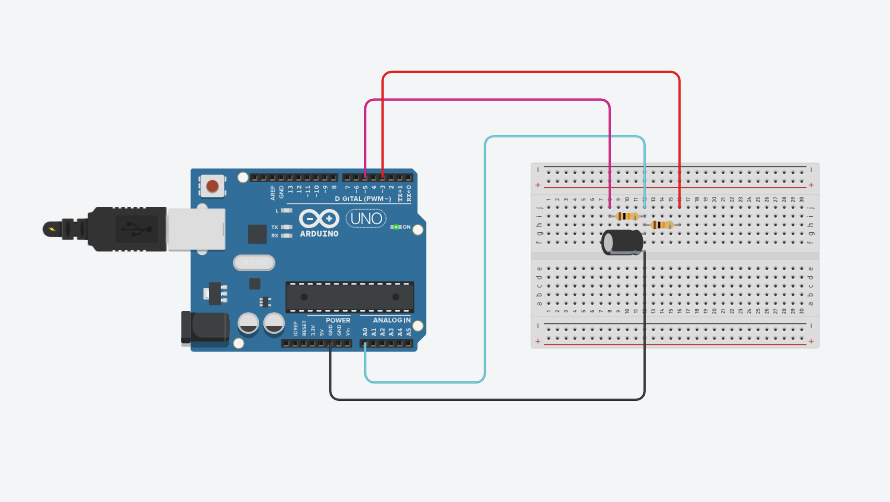

A capacitor is an electronic component designed to **store energy in the form of an electric field**. It has the characteristic of **resisting changes in voltage**, making it valuable for various applications such as filtering, timing, and smoothing power supplies.

Here's a breakdown of key aspects related to capacitors:

*   **Construction**:
    *   A capacitor is built with **two conductive plates**, typically made of metal.
    *   These plates are separated by a **dielectric**, which is an insulating material. Examples of dielectric materials include air, ceramic, or plastic.

*   **Key Formula (Charge)**:
    *   The relationship between charge, capacitance, and voltage across a capacitor is described by the formula: **Q = C ⋅ V**.
    *   In this formula:
        *   **Q** represents the **charge** stored in Coulombs.
        *   **C** stands for **capacitance** in Farads.
        *   **V** is the **voltage across the plates** in Volts.

*   **Capacitance (C)**:
    *   Capacitance is measured in **Farads (F)**.
    *   It quantifies **how much charge** a capacitor can store for each volt applied across its plates.
    *   Common sizes of capacitors are typically expressed in smaller units like **microfarads (µF), nanofarads (nF), and picofarads (pF)**.

*   **Charging and Discharging**:
    *   **Charging**: When a capacitor is connected to a power supply through a resistor, it **does not charge instantaneously**. Instead, the **voltage across the capacitor rises slowly**.
    *   **Discharging**: If the power supply is disconnected and the capacitor is connected across a resistor, the **voltage gradually drops** as the stored energy is released.

*   **Time Constant (τ - Tau)**:
    *   The time constant is a crucial concept for understanding capacitor timing circuits. It indicates **how quickly the capacitor charges or discharges**.
    *   **Formula**: The time constant (τ) is calculated by multiplying the resistance (R) by the capacitance (C): **τ = R ⋅ C**.
        *   τ is measured in seconds.
        *   R is in Ohms.
        *   C is in Farads.
    *   **Meaning in terms of voltage**:
        *   After **1τ** (one time constant), a charging capacitor reaches approximately **63.2%** of the supply voltage.
        *   After **2τ**, it reaches approximately **86.5%**.
        *   After **3τ**, it reaches approximately **95%**.
        *   After **5τ**, a capacitor is generally considered **fully charged**, reaching about **99.3%** of the supply voltage.
        *   The same logic applies to discharging: after 1τ, the voltage falls to 36.8%, and so on.
    *   **Charging Formula**: The voltage across a charging capacitor at any given time (t) is calculated using: **V(t) = Vmax ⋅ (1 - e^(-t/τ))**.
    *   **Discharging Formula**: The voltage across a discharging capacitor at any given time (t) is calculated using: **V(t) = Vmax ⋅ e^(-t/τ)**.
        *   Where 'e' is Euler’s number (approximately 2.718), 't' is time in seconds, and 'τ' is the time constant.
    *   **Real-World Example**: If you have a resistor (R) of 10kΩ and a capacitor (C) of 100µF, the time constant (τ) would be 10,000 Ω * 0.0001 F = **1 second**. This means in 1 second, it charges to 63.2%, and in 5 seconds, it's nearly fully charged.

*   **Applications of Capacitors**:
    *   **Smoothing out voltage** in power supplies.
    *   Used in **timing circuits** (leveraging RC time constants).
    *   **Filtering signals** in various electronic applications like audio and radios.
    *   **Coupling/decoupling** in amplifier circuits.
    *   **Energy storage** for applications such as camera flashes or pulsed lasers.

*   **Quick Intuition**:
    *   A capacitor will **block Direct Current (DC)** once it is charged.
    *   However, it generally **allows Alternating Current (AC) to pass through**, depending on the frequency.
    *   A **bigger capacitor** means more charge storage, which results in a **slower change in voltage**.

*   **Capacitor in an RC Circuit**:
    *   In a basic RC charging circuit, at **t = 0 (the initial moment)**, the capacitor behaves like a **short circuit** (meaning 0V across it).
    *   As time progresses, the capacitor **"resists" charging**, causing its voltage to increase gradually.
    *   Concurrently, the current flowing through the circuit decreases over time.
    *   Eventually, the **voltage across the capacitor equals the supply voltage**, and the current flowing through the circuit becomes zero.
