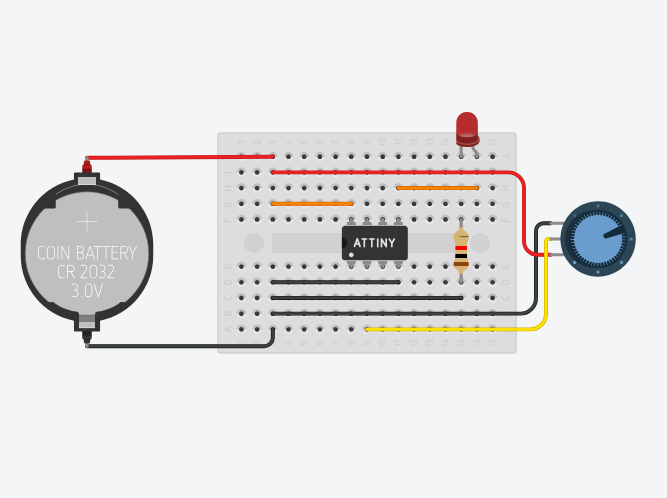
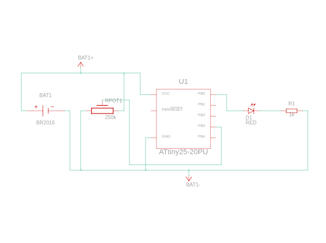

# Controlling Brightness of LED with ATtiny and Potentiometer

### Components
-  ATtiny
-  Coin Cell 3V Battery
- Red LED
- 1 kΩ Resistor
- 250 kΩ Potentiometer

### Circuit View

### Circuit Schematic
