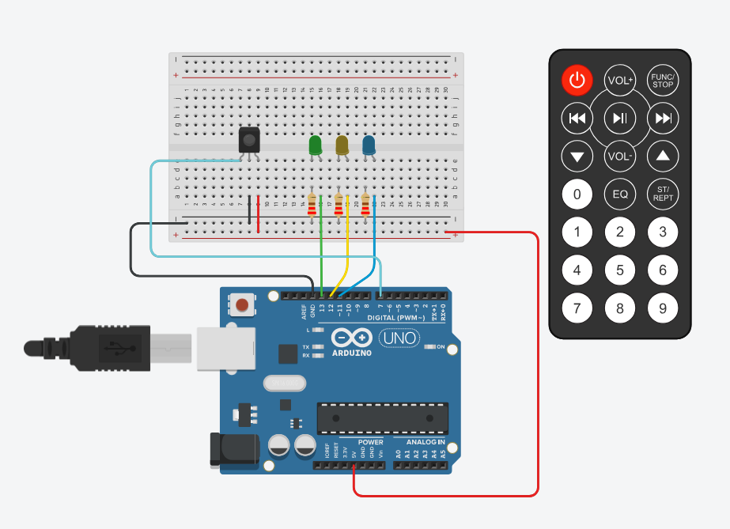
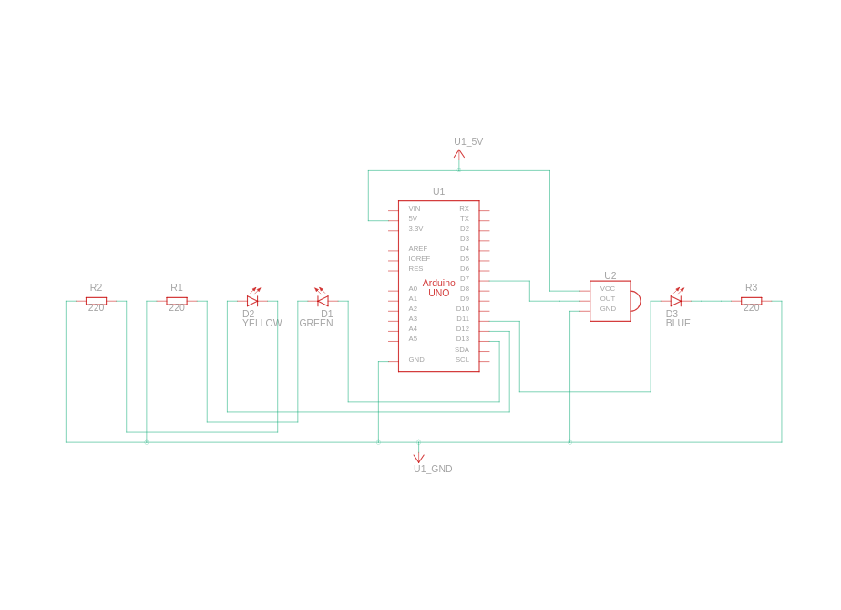

# Controlling LEDs Using IR Remote
#### Video Link: [Controlling LEDs using IR Remote and Arduino UNO on TinkerCAD](https://youtu.be/Lk_oFu-3aw4?si=5Uw-V8XpPi_ma50P)

### Components
- Arduino UNO R3
- Green LED
- Yellow LED
- Blue LED
- 220 Ω Resistor
- IR sensor

### Circuit View

### Circuit Schematic
