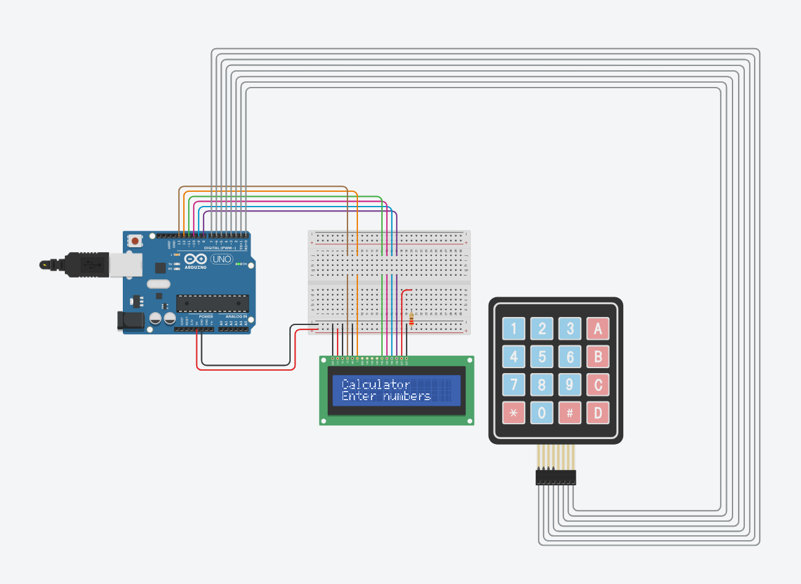

# Arduino DIY Calculator
#### Video Link: [Arduino DIY Calculator using a 4*4 Keypad and 16*2 LCD Display](https://youtu.be/dgGfoHlhugs?si=t00znWjtsHHOfX_G)

### Circuit View

### Code Explaination
```cpp
LiquidCrystal lcd(13, 12, 11, 10, 9, 8);
```
Initializes the LCD and sets the Arduino digital pins connected to RS, E, D4–D7.
<br><br>

```cpp
long first = 0, second = 0;
double total = 0;
char custom_key;
int cursor_pos = 0;
```
`first` and `second` are the two numbers you input. <br>
`total` is the result.<br>
`custom_key` is the current key pressed in the keypad. <br>
`custom_pos` tracks where on the LCD you are printing characters.
<br><br>

```cpp
const byte ROWS = 4;
const byte COLS = 4;

char keys[ROWS][COLS] = {
  {'1', '2', '3', '+'},
  {'4', '5', '6', '-'},
  {'7', '8', '9', '*'},
  {'c', '0', '=', '/'}
};
```
Defines the keymap of 4x4 keypad.
<br><br>

```cpp
byte rowPins[ROWS] = {7, 6, 5, 4};
byte colPins[COLS] = {3, 2, 1, 0};

Keypad custom_keypad = Keypad(makeKeymap(keys), rowPins, colPins, ROWS, COLS);
```
This maps the keypad to the correct Arduino pins.
- `makeKeymap(keys)` Provides the key layout (what characters are at each row/col).
- `rowPins` Maps each row wire to the Arduino.
- `colPins` Maps each column wire to the Arduino.
- `COLs` `ROWS` Tells the library how big the matrix is (4x4)
<br><br><br>

```cpp
void setup() {
  lcd.begin(16, 2);               // Initialize a 16x2 LCD
  lcd.setCursor(0, 0);
  lcd.print("Calculator");       // Line 1
  lcd.setCursor(0, 1);
  lcd.print("Enter numbers");    // Line 2
  delay(4000);                   // Wait 4 seconds
  lcd.clear();                   // Clear screen
  lcd.setCursor(0, 0);
  cursor_pos = 0;
}
```
Displays a welcome message, prepares LCD for calculation
<br><br>

```cpp
char key = custom_keypad.getKey();
```
Return the pressed key from the keypad
<br><br>

```cpp
case '0' ... '9':
    first = first * 10 + (custom_key - '0');
    lcd.print(custom_key);
    cursor_pos++;
    break;
```

The `case` syntax means "if `custom_key` is any character between `'0'` and `'9'`"<br><br>
`first = first * 10 + (custom_key - '0');` This line builds a multi-digit number from individual key presses. Like pressing 5 and 3 to make 53.<br><br>

```cpp
case '+':
    first = (total != 0 ? total : first);
    lcd.print("+");
    cursor_pos++;
    second = secondNumber();
    total = first + second;
    lcd.setCursor(0, 1);
    lcd.print("Result: ");
    lcd.print(total);
    first = 0; 
    second = 0;
    break;
```
If custom key is `'+'` then `first = (total != 0 ? total : first);` store first number (or total number from previous answer)
<br><br>

```cpp
long secondNumber() {
  while(1) {
    custom_key = custom_keypad.getKey();
    if (custom_key >= '0' && custom_key <= '9') {
      second = second * 10 + (custom_key - '0');
      lcd.print(custom_key); // Show digit as it's typed
      cursor_pos++;
    }
    if (custom_key == '=') break;
  }
  return second;
}
```
Just like `first` we also calculate the `secondNumber()`.<br>
> 🧠 **Note**<br>
> `'0'` substracted each time from the custom keys to get the actual values of integer number.<br>
For example, char `'0'` has a ASCII value of 48, if you press 5 which has a ASCII value of 53, the substracted result will be 5