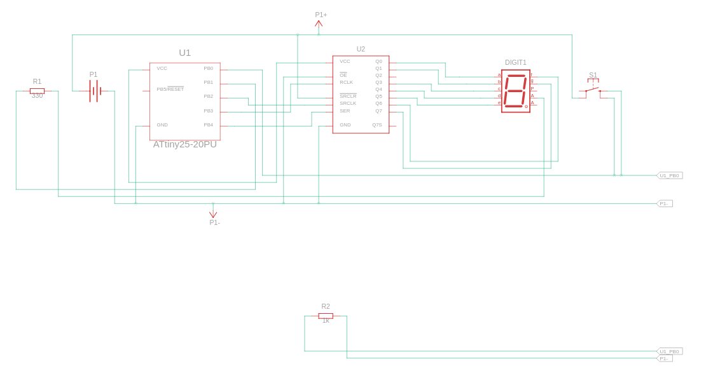

# Dice with 7 Segment Display and ATtiny

### Components
- Anode 7 Segment Display
- ATtiny
- 0.8 , 5 Power Supply
-  8-Bit Shift Register
- 330 Ω Resistor
- 1 kΩ Resistor
-  Pushbutton

### Circuit View

### Circuit Schematic
