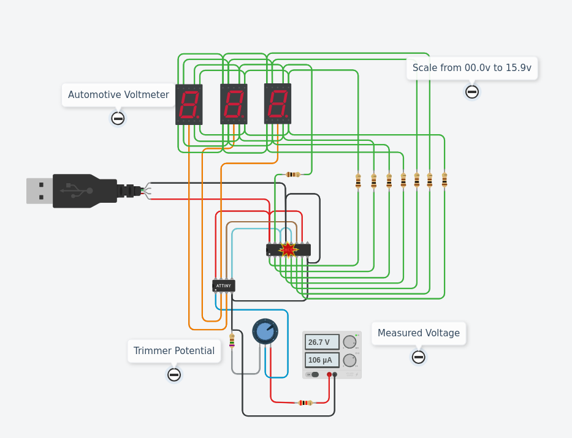
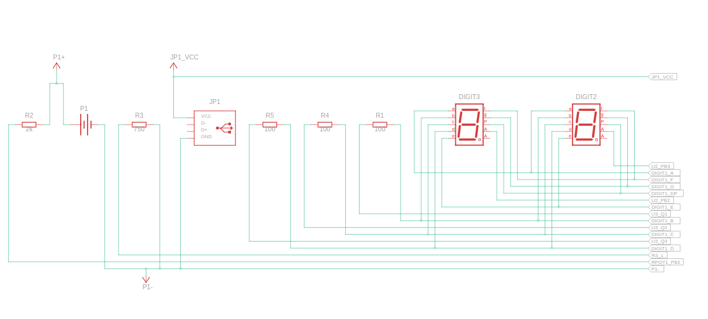
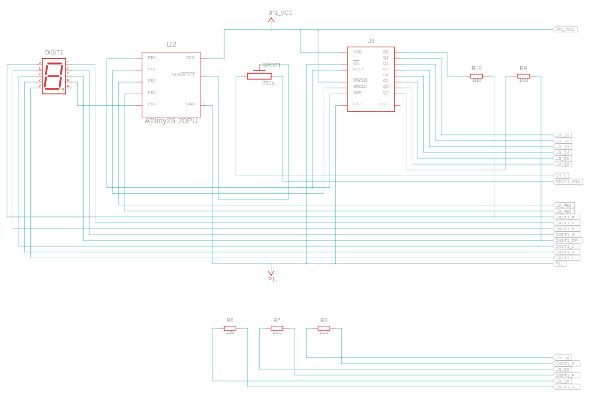

# Digital Voltmeter Using ATtiny85 and Seven Segment Display

### Components
- Anode 7 Segment Display (x3)
- 100 Ω Resistor (x8)
- 250 kΩ Potentiometer (x1)
- 26.7 , 3.5 Power Supply (x1)
- 2 kΩ Resistor (x1)
-  ATtiny (x1)
-  USB standard A (x1)
- 750 Ω Resistor (x1)
-  8-Bit Shift Register (x1)

### Circuit View

### Circuit Schematic

Sheet 1  

Sheet 2  