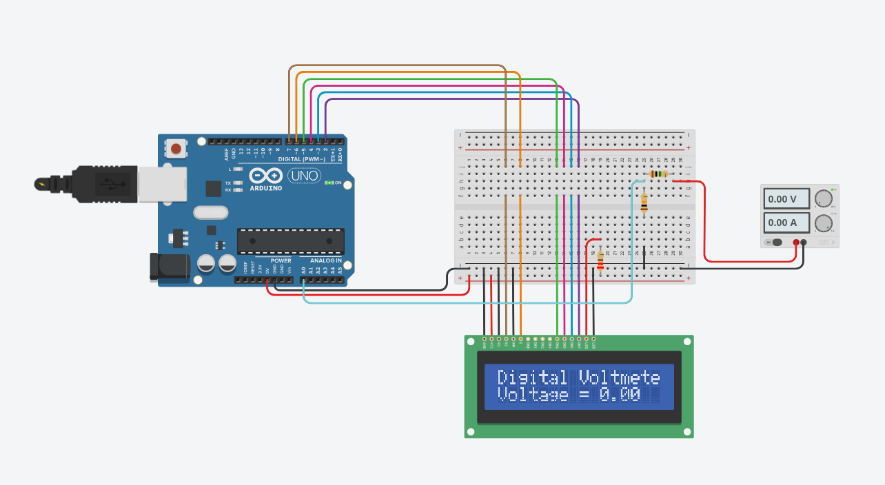
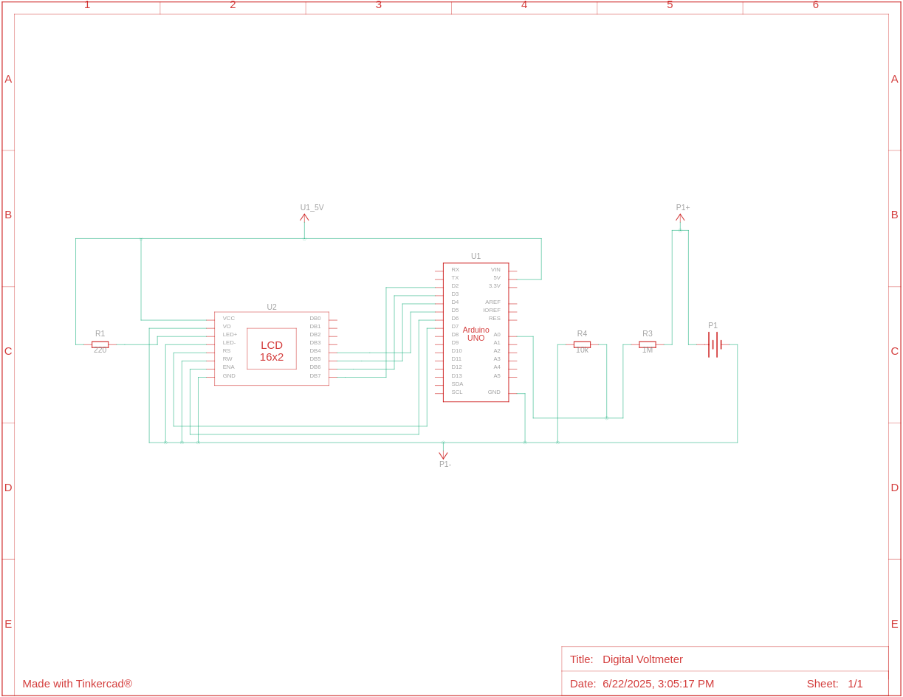

# Digital Voltmeter
#### Video Link: [Digital Voltmeter Using Arduino - YouTube](https://youtu.be/8QOBFsRB3Q4?si=zRHVrlljNGq7zB3j)

This circuit shows how to build a digital voltmeter using Arduino UNO and a LCD 16x2 display.

### Components
- Arduino Uno R3
- LCD 16 x 2
- 220 Ω Resistor
- 4.1 , 5 Power Supply
- 1 MΩ Resistor
- 10 kΩ Resistor


### Circuit View



### Component Placement and Explaination
A voltage divider is used for stepping down the voltage to a safe range for Arduino's analog input. A small percentage of error can be seen due to this reason.
<br>
The anode of voltmeter is connected to the  resistor. The voltage gets divided between  resistor and  resistor. That is the point where we draw the analog read point `A0`.
<br><br>
Other pins are:
- RS --> 7
- E --> 6
- D4 - D7 --> 5 - 2

### Circuit Schematic


### Code Explanation
Defining initial values
```cpp
// initial values
float input_voltage = 0.0;
float temp = 0.0;
float r1 = 1000000.0;
float r2 = 10000.0;
```

Analgo values from the arduino ranges from 0 - 1023, indicating 0 for 0V and 1023 for 5V. So we convert the analog values to actual voltage values.
```cpp
float analog_value = analogRead(A0);
temp = (analog_value * 5.0) / 1024.0;
input_voltage = temp / (r2 / (r1 + r2));
```

Finally we print the input voltages
```cpp
if (input_voltage < 0.1) {
    input_voltage = 0.0;
  }
Serial.print("V = ");
Serial.println(input_voltage);
lcd.setCursor(0, 1);
lcd.print("Voltage = ");
lcd.print(input_voltage);
delay(1000);
```
