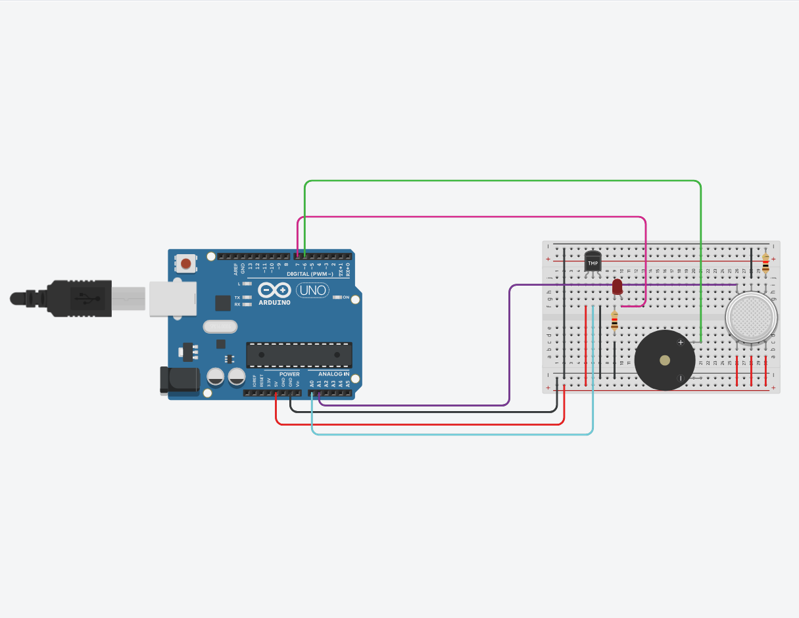
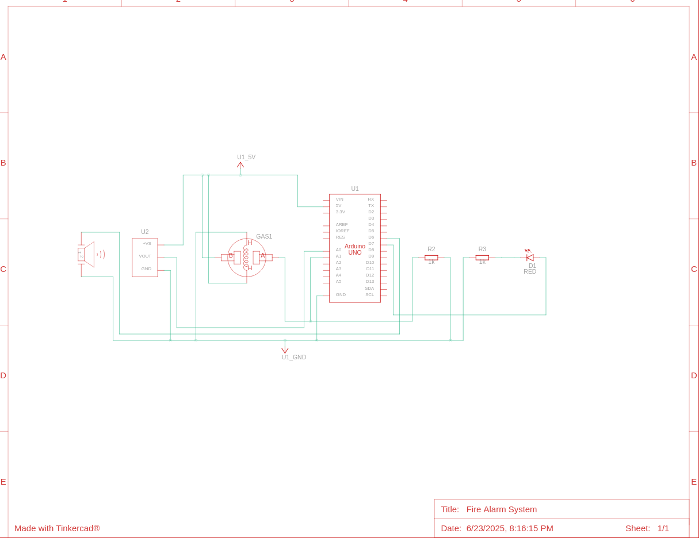

# Fire Alarm System Using Temperature and Gas sensor
#### Video Link: [Fire Alarm System Project by Interfacing Arduino with Temperature & Gas Sensor | TinkerCAD Projects](https://youtu.be/fwwI4R_97DI?si=saEhnhwJA-W2VYVp)

# Components

# Circuit View

# Circuit Schematic

