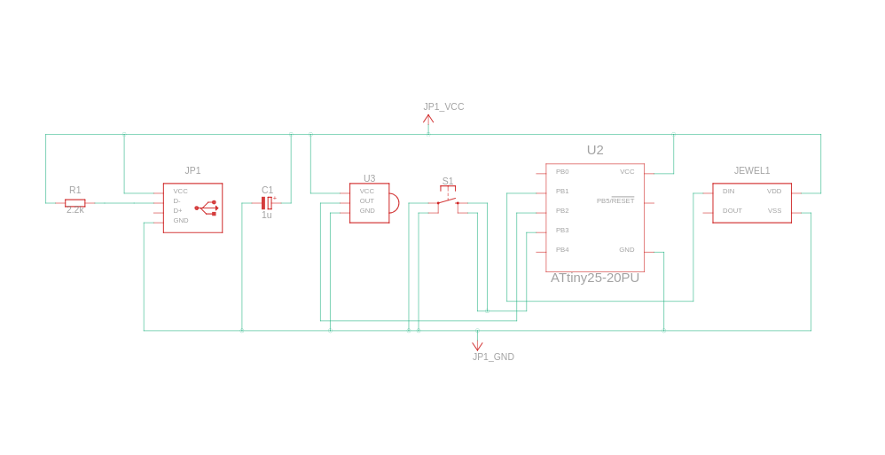

# Interfacing NeoPixel Jewel

### Components
-  USB standard A
- 2.2 kΩ Resistor
- 1 uF, 16 V Polarized Capacitor
-  ATtiny
-  Pushbutton
-  IR sensor
-  NeoPixel Jewel

### Circuit View

### Circuit Schematic
