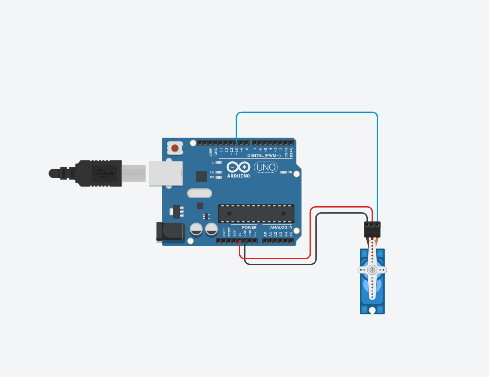
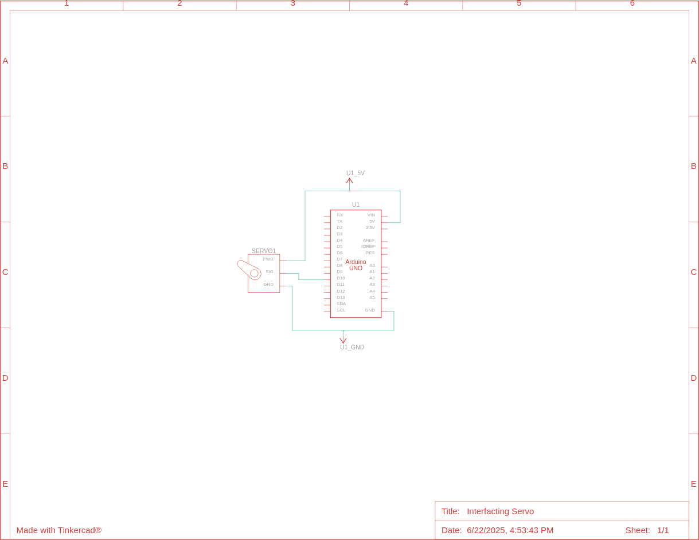

# Interfacing Servo Motor with Arduino
#### Video Link: [Interfacing Servo Motor Using Arduino - YouTube](https://youtu.be/_tsl8B3Mrdg?si=_ANjfLLF38wADA7E)

This circuit shows how a servo is connected to a Arduino and how the PWM controls the rotation of a servo

#### **PWM Values for Rotation**
The pulse width of PWM defines how the servo should be rotated. Such as - if the pulse width is 1ms then the rotational degree is . If the pulse width is 1.5ms, then the rotational degree is . And finally, if the pulse width is 2ms, then the rotational degree is 

### Circuit View


### Circuit Schematic


### Code Explanation
Creating servo objects from servo library
```cpp
#include<Servo.h>

Servo MyServo;
```

set initial position
```cpp
int pos = 0;
```
Attach servo pin to servo object
```cpp
void setup() {
  MyServo.attach(10);
}
```
Make a loop for the servo to rotate from 0 to 180 degree. Servos need time to reach each position. That's why a `delay(15)` is given, otherwise, they will jitter or behave unpredictably.
```cpp
for(pos = 0; pos <= 180; pos++) {
  MyServo.write(pos);
  delay(15);
}

delay(3000);
```

Make a loop for the servo to reach from 180 degree to 0 degree
```cpp
for(pos = 180; pos >= 0; pos--) {
  MyServo.write(pos);
  delay(15);
}

delay(1000);
```