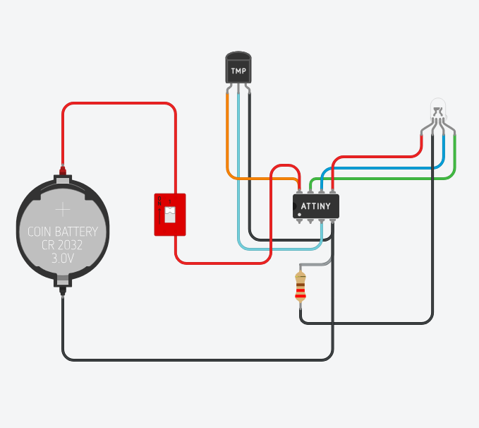
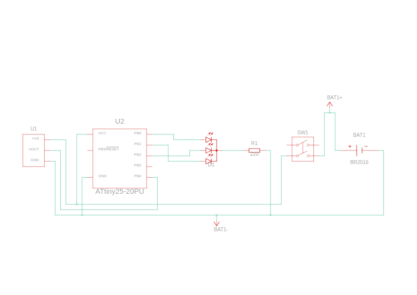

# Interfacing TMP36 with ATtiny85

### Components
-  Coin Cell 3V Battery
-  Temperature Sensor [TMP36]
-  ATtiny
- 220 Ω Resistor
- RCBG LED RGB
-  DIP Switch DPST

### Circuit View

### Circuit Schematic
