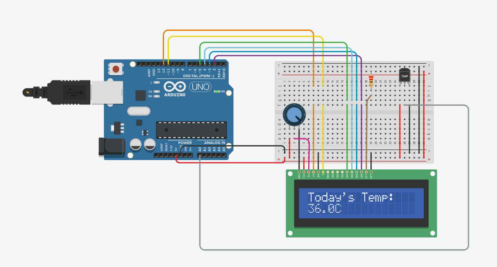
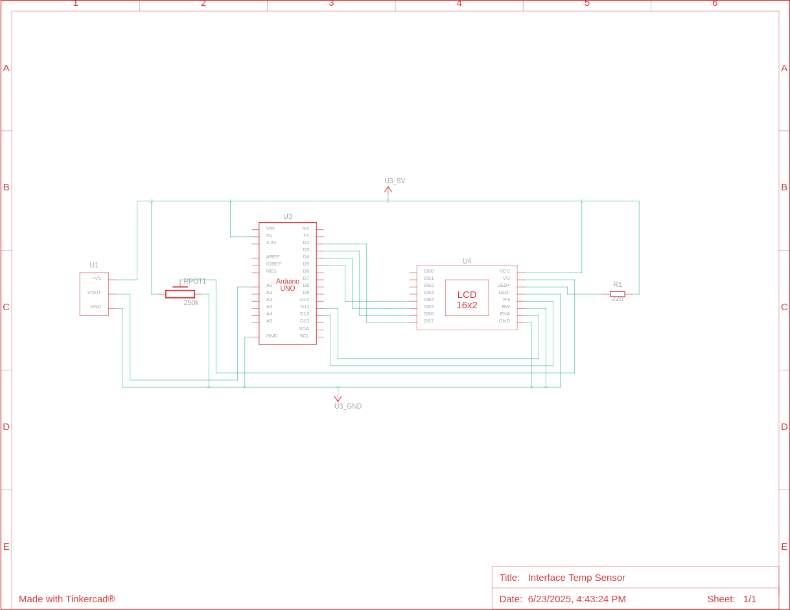

# Interfacing Temperature Sensor and LCD
#### Video Link: [HOW TO INTERFACE TEMPERATURE SENSOR AND LCD WITH ARDUINO: Digital Thermometer using LCD and Arduino](https://youtu.be/RTNcZSVdwLY?si=10OtubhnJMeQhUxz)

### Components
-  Arduino Uno R3
-  LCD 16 x 2
- 250 kΩ Potentiometer
- 220 Ω Resistor
-  Temperature Sensor [TMP36]

### Circuit View

## Circuit Schematic
