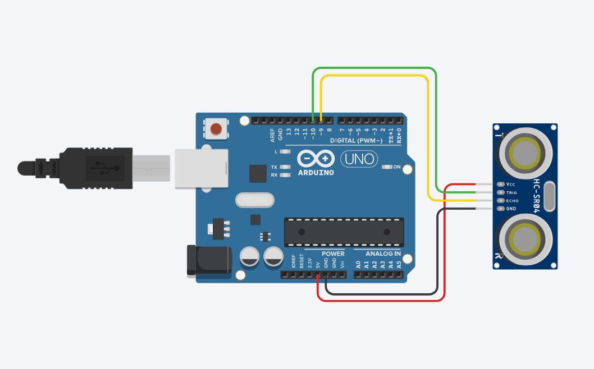
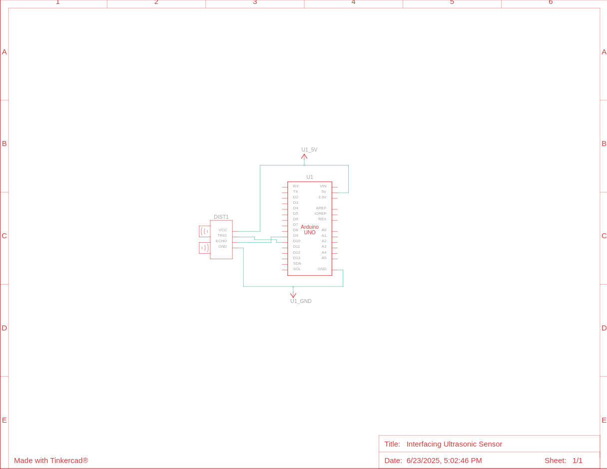

# Interfacing Ultrasonic Sensor with Arduino
#### Video Link: [How to Interface an Ultrasonic Sensor with Arduino using TinkerCAD](https://youtu.be/dgQuT0zOOpc?si=rV7ZFtIF6kuuSTBt)

### Components
- Arduino UNO R3 (x1)
- Ultrasonic Distance Sensor (4-pin)

### Circuit View

### Circuit Schematic
