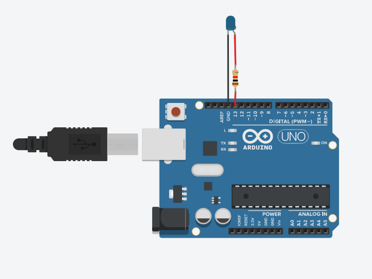
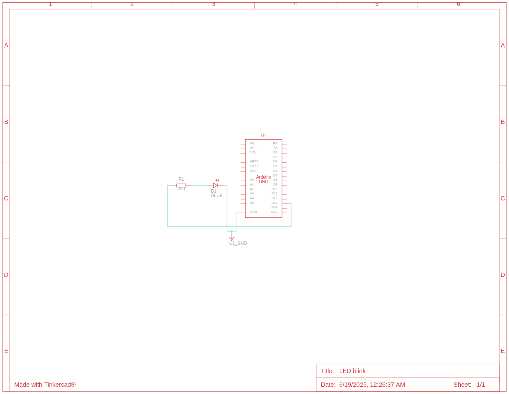

# LED Blink
Video Link: [Learn to blink LED in 10 mins!!](https://www.youtube.com/watch?v=xZ3OWzZEx10&list=PLWqnlHhsmcI4eBDLBtaZs16XZq0WL1SlP&index=38)

### Components
- Arduino Uno R3 (x1)
- LED (x1)
- 220Ω Resistor (x1)



### Components Placement and Explanation
- **LED:** An LED is placed on the Arduino with it's cathode to GND and anode to pin 13 through a resistor.
- **Resistor:** To limit the current flow through the LED.

### Circuit Schematic


### Code Explanation
```cpp
#define LED_BUILTIN 13  // defined LED pin

void setup()
{
  // Defining LED output pin
  pinMode(LED_BUILTIN, OUTPUT);
}

void loop()
{
  // Making the LED turn on
  digitalWrite(LED_BUILTIN, HIGH);
  // LED on for 1000 miliseconds
  delay(1000);
  // Making the LED turn off
  digitalWrite(LED_BUILTIN, LOW);
  // LED off for 1000 miliseconds
  delay(1000);
}
```
