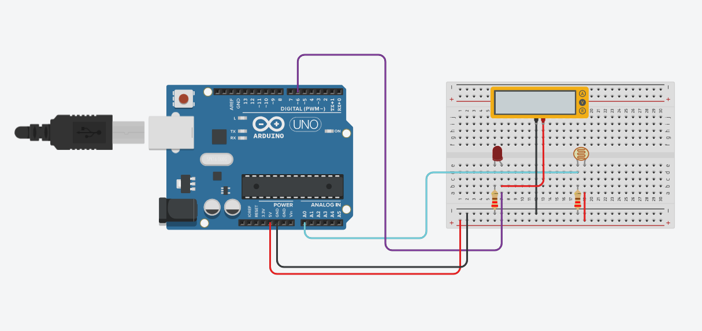
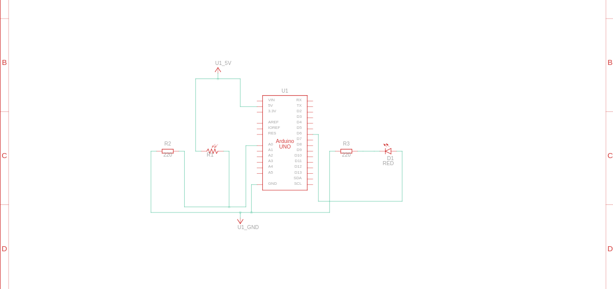

# Light Intensity Measurement with LDR Sensor
#### Video Link: [Light Intensity Measurement using LDR sensor and Arduino on TinkerCAD](https://youtu.be/4ibf6wHOIok?si=8uSqONFRCeCDQmAN)

### Components
-  Arduino Uno R3 (x1)
- Photoresistor (x1)
- Red LED (x1)
- Voltage Multimeter (x1)
- 220 Ω Resistor (x1)

### Circuit View

### Circuit Schematic
