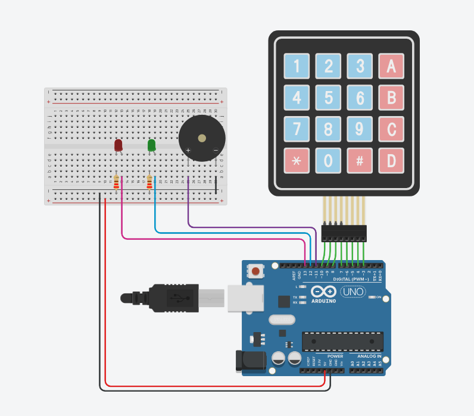
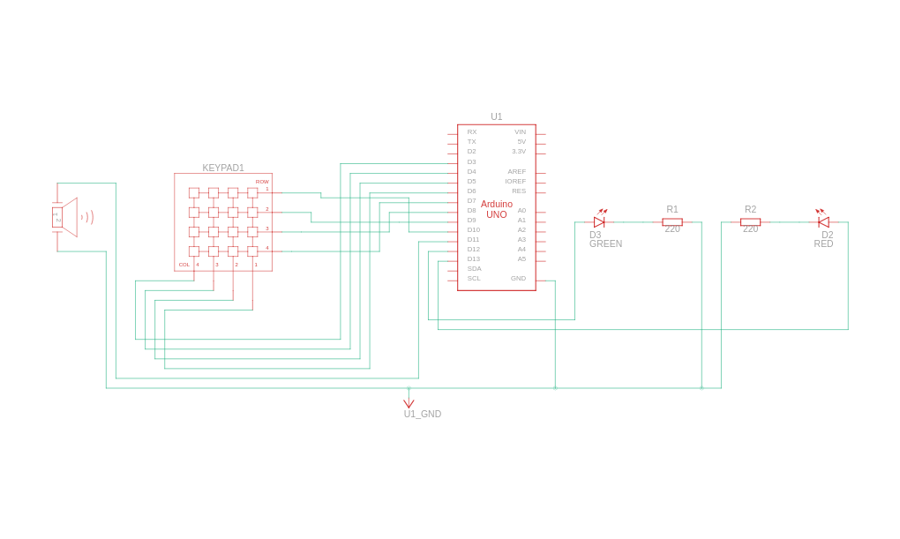

# Password Security System Using Arduino, Keypad, Piezo & LED
#### Video Link: [Password Protected Security System project using Arduino, Keypad, Piezo Buzzer, and LED on TinkerCAD](https://youtu.be/r8snYg7QW4o?si=phqOKif3-2_KsWz3)

### Components
- Arduino UNO R3 (x1)
- Green LED (x1)
-  Keypad 4x4 (x1)
-  Piezo (x1)
- Red LED (x1)
- 220 Ω Resistor (x1)

### Circuit View

### Circuit Schematic
