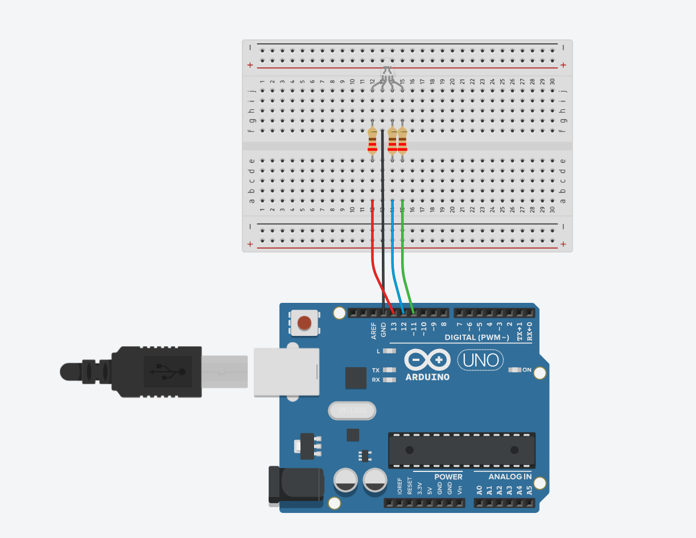
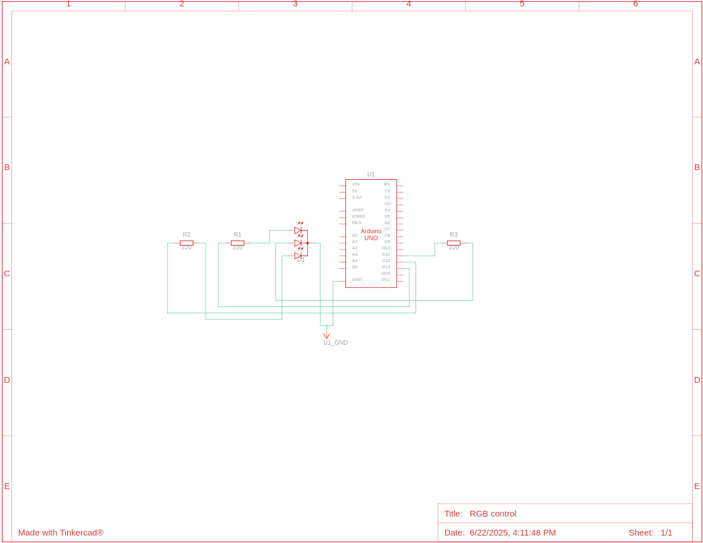

# Controlling RGB LED with PWM
#### Video Link: [Controlling RGB LED with PWM in TinkerCAD - YouTube](https://youtu.be/Y5wmQkrL2Fc?si=Tfy5397p2mQw3NWU)

This circuit shows how we can control RGB LED with Arduino PWM output

### Components
- Arduino Uno (x1)
- RGB LED (x1)
- 220 Ω Resistor (x3)

### Circuit View

Only the black wire connected to the RGB LED is the cathode, rest of the nodes are anode

### Circuit Schematic



### Code Explanation
We defined a `color()` that helps the code concise and easy to repeat. `unsigned` is used to define parameters that only except non-negative values. `unsigned char` is convertable to string, so it is safer to use as pwm values need to be between 0 - 255. `unsigned char` used 8 bit resolution which ranges from 0 - 255
```cpp
void color(unsigned char red, unsigned char green, unsigned char blue) {
  analogWrite(RED, red);
  analogWrite(GREEN, green);
  analogWrite(BLUE, blue);
}
```
<br><br>
Now just define the function in `loop()` as it suits your need.
```cpp

void loop() {
  color(255, 0, 0); // red
  delay(500);
  color(0, 255, 0); // green
  delay(500);
  color(0, 0, 255); // blue
  delay(500);
  color(255, 255, 255); // white
  delay(500);
  color(0, 0, 0); // Off
  delay(500);
}
```
