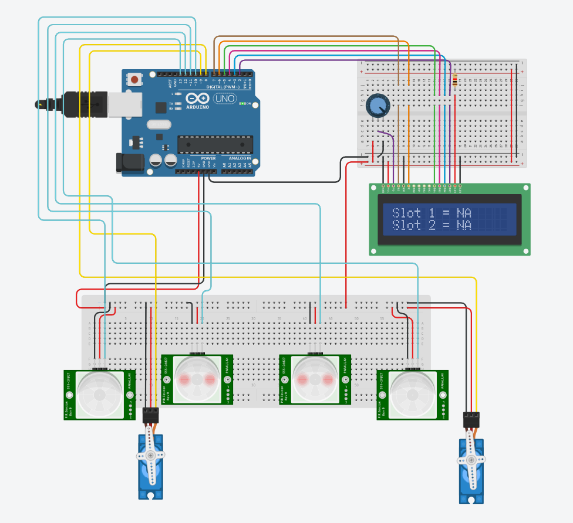
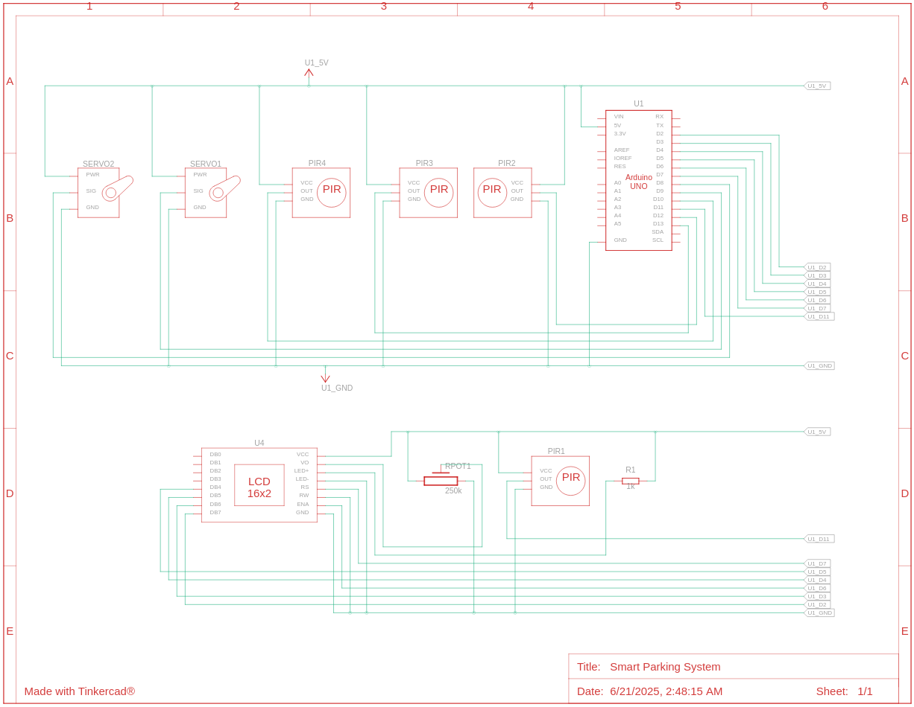

# Smart Parking System Using Arduino
#### Video Link: [Smart Parking System Using Arduino || TinkerCAD](https://www.youtube.com/watch?v=1LM8OSCCthE&list=PLWqnlHhsmcI4eBDLBtaZs16XZq0WL1SlP&index=37)

This is a simple Smart Car Parking system that uses a LCD display to show if the car slots are taken or not. Also there are sensors for cars to enter and leave using servos to use as gates.

### Components
- Arduino Uno R3 (x1)
- PIR Sensor (x4)
- Positional Micro Servo (x2)
- LCD 16 x 2 (x1)
- 250 kΩ Potentiometer (x1)
- 1 kΩ Resistor (x1)

### Circuit View


### Compnent Placement and Explanation
Two IRs are used as entry and exit sensor. Other two are used for parking slot.<br>
A potentiometer has been used to control the contrast to LCD display. The pins are connected as following:
- RS --> 7
- E --> 6
- D4 - D7 --> 5 - 2
- V0 --> Potentiometer

Other pins are:
- Servo 1 --> 9
- Servo 2 --> 8
- IR_entry --> 10
- IR_Slot1 --> 11
- IR_Slot2 --> 12
- IR_Exit --> 13


### Circuit Schematic


### Code Explanation
```cpp
#include<LiquidCrystal.h>
#include<Servo.h>

// servo objects
Servo S1, S2;

// define IR pins

int pos = 0; // initial pos of Servo motors

LiquidCrystal lcd(RS_pin, E_pin, D4, D5, D6, D7);

void setup() {
  // define servo pins and set initial position

  // set IR pins

  lcd.begin(16, 2); // to start 16x2 lcd screen
  lcd.print(); // to print something on the column
  lcd.setCursor(); // to locate where to print
  lcd.clear(); // to clear everything from the screen
}

void loop() {
  if (/*IR_Slot1 is HIGH*/ ) {
    // move cursor to first line
    // print "Slot1 = NA
  } else {
    // move cursor to second line 
    // print "Slot1 = A
  }

  if (/*IR_Slot2 is HIGH*/ ) {
    // move cursor to first line
    // print "Slot2 = NA
  } else {
    // move cursor to second line 
    // print "Slot2 = A
  }

  if (/* IR_Entry sensor is HIGH */) {
    S1.write(pos + 90) // move +90 deg from initial position
  } else {
    S1.write(pos)
  }
  
  if (/* IR_Exit sensor is HIGH */) {
    S2.write(pos + 90) // move +90 deg from initial position
  } else {
    S2.write(pos)
  }
}
```